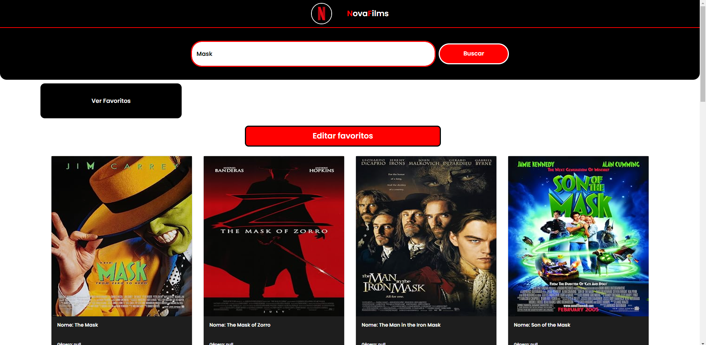
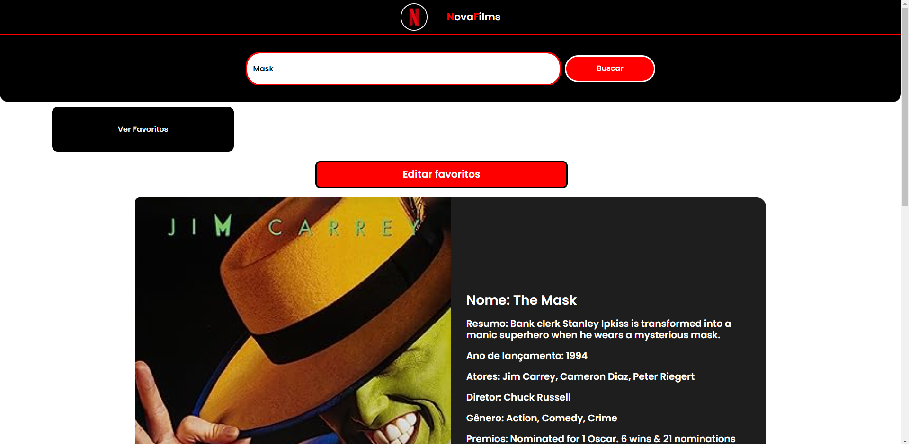

# Catalogo de filmes

### Sobre este projeto 📚

Este projeto se baseia em um catálogo de filmes, onde é possível pesquisar por filmes e ver detalhes sobre eles. Além disso, é possível favoritar filmes e ver os filmes favoritados e excluir filmes da lista de favoritos.

### Tecnologias utilizadas 🛠

- Javascript
- CSS
- HTML

<a href="https://andreimartinscoelho.github.io/NovaFilmes/">aqui está o link do projeto...</a>

### Uma prévia do projeto 🖥

